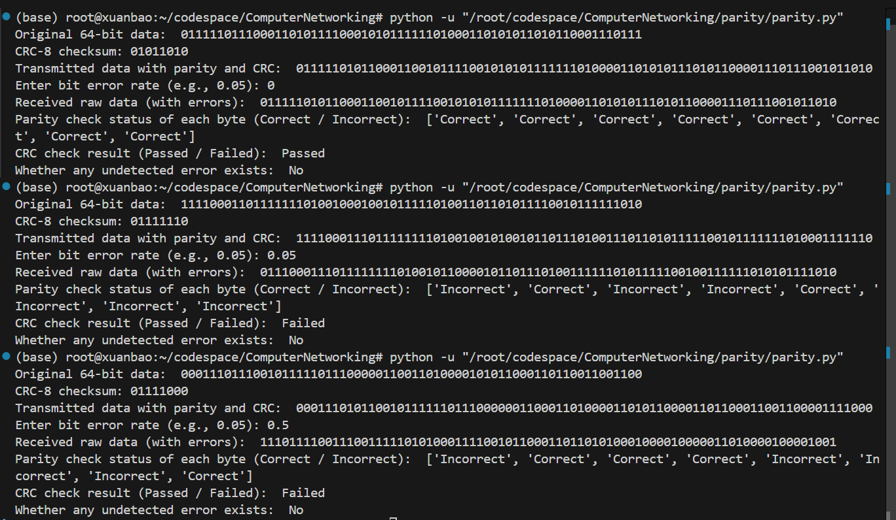

# Assignment 4: Error Detection Techniques
## Task1: Perform Parity Check and CRC Calculation
#### Two-dimensional parity check
This is the correct condition:
|            | 0   | 1   | 2   | 3   | row parity |
| ---------- | --- | --- | --- | --- | ---------- |
| 0          | 1   | 0   | 1   | 1   | 1          |
| 1          | 0   | 1   | 0   | 0   | 1          |
| 2          | 1   | 1   | 1   | 0   | 1          |
| 3          | 0   | 0   | 1   | 1   | 0          |
| col parity | 0   | 0   | 1   | 0   |            |

In the following example, we can locate the mistake at the **bold cell**, and flip the bit to correct it.
|            | 0   | 1   | 2     | 3   | row parity |
| ---------- | --- | --- | ----- | --- | ---------- |
| 0          | 1   | 0   | 1     | 1   | 1          |
| 1          | 0   | 1   | 0     | 0   | 1          |
| 2          | 1   | 1   | 0     | 0   | **0**      |
| 3          | 0   | 0   | 1     | 1   | 0          |
| col parity | 0   | 0   | **0** | 0   |            |

The following is an instance where we can detect the occurrence of an error but cannot correct it.
|            | 0   | 1     | 2     | 3   | row parity |
| ---------- | --- | ----- | ----- | --- | ---------- |
| 0          | 1   | 0     | 1     | 1   | 1          |
| 1          | 0   | 0     | 0     | 0   | **0**      |
| 2          | 1   | 1     | 0     | 0   | **0**      |
| 3          | 0   | 0     | 1     | 1   | 0          |
| col parity | 0   | **1** | **0** | 0   |            |
#### CRC Calculation
1. G = 10011, D = 1010101010: R = 0100
```
10011 ) 10101010100000
        10011
          11001
          10011
           10100
           10011
             11110
             10011
              11010
              10011
               10010
               10011
                  0100
```
2. G = 11001, D = 1010101010: R = 0010
```
11001 ) 10101010100000
        11001
         11000
         11001
             11010
             11001
                11000
                11001
                  0010
```
3. G = 10011, D = 11000011: R = 0101
```
11001 ) 110000110000
        11001
            10110
            11001
             11110
             11001
               11100
               11001
                0101
```
## Task2: CRC Implementation
The code is [parity.py](parity.py).
The output pattern is as follows:
```
Original 64-bit data: <0/1 string>
CRC-8 checksum: <0/1 string>
Transmitted data with parity and CRC: <0/1 string>
Enter bit error rate (e.g., 0.05): [input float]           
Received raw data (with errors): <0/1 string>
Parity check status of each byte (Correct / Incorrect):  <list of Incorrect/Correct>
CRC check result (Passed / Failed):  <Passed/Failed>
Whether any undetected error exists:  <Yes/No>
```
It is very difficult to find the exact error bit positions, as the Data Frame Construction uses one-dimensional parity check, which does not have error correction capability, and CRC only serves to detect the occurrence of errors but not their positions.  
If you want to output error bit positions, you can use two-dimensional parity check or error-correcting codes such as Hamming code.  
Below are several actual test cases using the implemented program. Each test demonstrates the output format and the detection capability of the parity check and CRC mechanism.

You can see that when the error rate increases, more bits are fliped, but the parity check is not representitive for the error rate(extremely, when error rate = 1, all parity bits are correct). Also, the error rate is an expectation, so maybe the real fliped bit number is greater than length * errorrate(the second test above, 6 truely fliped with 4 flip expected):
```
111100011 101111111 101001001 010010110 111010011 101101011 111001011 111110100 01111110
011100011 101111111 101001011 000010110 111010011 111101011 111001001 111110101 01111010
I         C                I   I        C          I               I          I
```
Normally, parity and crc are very sensitive(parity cheated in prob $p^2=0.05^2=0.25\% $ per byte)  
Obviously, the probability that CRC passed but the data was actually corrupted is very low. I used while-loop to randomly find such conditions, and the average total iterations until undetected error are:
```
Error rate: 0.01, Average undetected error count: 573186.46
Error rate: 0.02, Average undetected error count: 80438.99
Error rate: 0.05, Average undetected error count: 13968.27
Error rate: 0.1, Average undetected error count: 23022.53
Error rate: 0.2, Average undetected error count: 53863.24
Error rate: 0.5, Average undetected error count: 64612.61
```
The distribution appears this way because when the error rate is very low, errors are rare, so it takes a long time to encounter an undetected error. As the error rate increases, undetected errors become more likely and the average count drops. However, when the error rate is very high, most errors are detected by parity or CRC, so undetected errors become rare again and the average count rises.  
A possible condition is as follow:
```
Original 64-bit data:  1010010000111111100111011011011001100000010011001010111001110010
CRC-8 checksum: 11001111
Transmitted data with parity and CRC:  10100100100111111010011101110110110101100000001001100110101110101110010011001111
Received raw data (with errors):  10100100100111111000010101010110110101100000011001000110101110101110010011000111
Parity check status of each byte (Correct / Incorrect):  ['Correct', 'Correct', 'Incorrect', 'Correct', 'Correct', 'Correct', 'Correct', 'Correct']
CRC check result (Passed / Failed):  Passed
Whether any undetected error exists:  Yes
```
In this condition, 
```
101001001 001111110 100111011 101101101 011000000 010011001 101011101 011100100 11001111
101001001 001111110 000101010 101101101 011000000 110010001 101011101 011100100 11000111
C         C         I   I   I C         C         I    I    C         C             I
```
Third byte has 3 flips: Incorrect; Sixth Byte has 2 flips: false Correct; CRC has one bit flip.
The possibility that CRC and parity are both cheated is very very small.