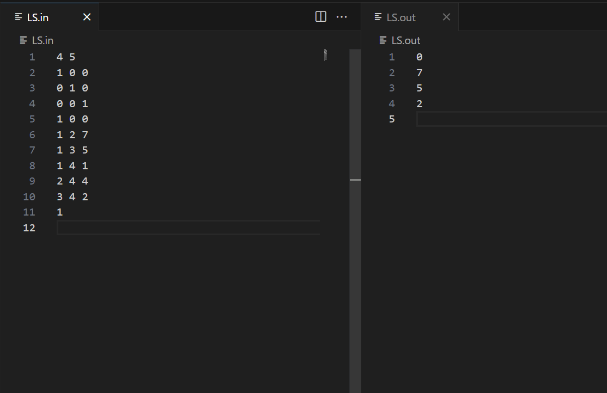
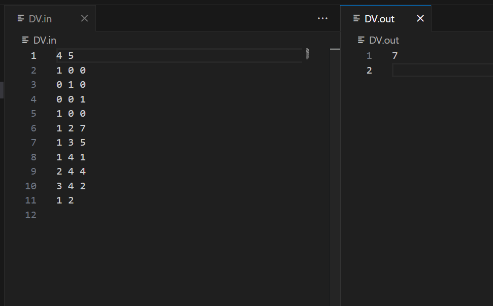

# Router algorithm report
### Zhong Jiaxuan, 2023010812
## Link State
### experiment result

### Complete src code
~~~c
#include <stdio.h>
#include <limits.h>

#define MAX_NODES 101
#define INF INT_MAX

int graph[MAX_NODES][MAX_NODES];
int router_delay[MAX_NODES];
int distances[MAX_NODES];

void dijkstra(int source, int n)
{
    int visited[MAX_NODES] = {0};

    // 初始化距离数组
    for (int i = 1; i <= n; i++)
        distances[i] = INF;
    distances[source] = 0;

    for (int count = 1; count <= n; count++)
    {
        int min_distance = INF, u = -1;

        // 找到未访问节点中距离最小的节点
        for (int i = 1; i <= n; i++)
        {
            if (!visited[i] && distances[i] < min_distance)
            {
                min_distance = distances[i];
                u = i;
            }
        }

        if (u == -1)
            break; // 所有可达节点已访问

        visited[u] = 1;

        // 更新邻居节点的距离
        for (int v = 1; v <= n; v++)
        {
            if (!visited[v] && graph[u][v] != INF)
            {
                int new_distance = distances[u] + graph[u][v];
                if (new_distance < distances[v])
                    distances[v] = new_distance;
            }
        }
    }
}

int main()
{
    freopen("LS.in", "r", stdin);
    freopen("LS.out", "w", stdout);

    int n, m;
    scanf("%d %d", &n, &m);

    for (int i = 0; i <= n; i++)
    {
        for (int j = 0; j <= n; j++)
        {
            graph[i][j] = INF;
        }
    }

    for (int i = 1; i <= n; i++)
    {
        int p, q, t;
        scanf("%d %d %d", &p, &q, &t);
        router_delay[i] = p + q + t;
    }

    for (int i = 1; i <= m; i++)
    {
        int x, y, z;
        scanf("%d %d %d", &x, &y, &z);
        graph[x][y] = z;
        graph[y][x] = z;
    }

    for (int i = 1; i <= n; i++)
    {
        for (int j = 1; j <= n; j++)
        {
            if (graph[i][j] != INF)
                graph[i][j] += router_delay[i];
        }
    }

    for (int i = 0; i <= n; i++)
        graph[i][i] = 0;

    int source;
    scanf("%d", &source);

    dijkstra(source, n);

    for (int i = 1; i <= n; i++)
    {
        if (i == source)
            printf("0\n");
        else
            printf("%d\n", distances[i]);
    }

    return 0;
}
~~~
### description
- The main function includes input from `LS.in` and output to `LS.out`.
- **Input:** The `router_delay[i]` serves for processing, queuing, and transmission delay for router i, while `graph[i][j]=k` means that from node `i` to node `j`, the propogation delay is `k`. We can add router delay to graph edge weights to simplify dijkstra if-else conditions.
- **Output:** From source to itself, distance is 0; else, as graph is connected, we output `distance[i]`.
- Between input and output there calls  dijkstra function, we use brute-force to implement very ordinary dijkstra algorithm (find the nearest unvisited node, and relax the edges from it to its neighbors).
## Distance Vector
### experiment result

### Complete src code
~~~c
#include <stdio.h>
#include <limits.h>

#define MAX_NODES 101
#define MAX_EDGES 101
#define INF INT_MAX

typedef struct
{
    int u, v, delay; // 边的两个节点和传播延迟
} Edge;

int router_delay[MAX_NODES];
Edge edges[MAX_EDGES];

int distance_vector_routing(int n, int m, int source, int to)
{
    // 初始化距离向量
    int distances[MAX_NODES];

    for (int i = 0; i <= n; i++)
        distances[i] = INF;
    distances[source] = 0;

    // 迭代 N-1 次
    int cnt = n - 1;
    while (cnt--)
    {
        int update_flag = 0;
        for (int j = 0; j < m; j++)
        {
            int u = edges[j].u;
            int v = edges[j].v;
            int delay = edges[j].delay;

            // 更新从 x 到 y 的距离
            if (distances[u] != INF && distances[u] + router_delay[u] + delay < distances[v])
            {
                distances[v] = distances[u] + router_delay[u] + delay;
                update_flag = 1;
            }

            // 更新从 y 到 x 的距离
            if (distances[v] != INF && distances[v] + router_delay[v] + delay < distances[u])
            {
                distances[u] = distances[v] + router_delay[v] + delay;
                update_flag = 1;
            }
        }
        if (!update_flag)
            break;
    }

    return distances[to];
}

int main()
{
    freopen("DV.in", "r", stdin);
    freopen("DV.out", "w", stdout);

    int n, m, source, to;

    scanf("%d %d", &n, &m);

    for (int i = 1; i <= n; i++)
    {
        int p, q, t;
        scanf("%d %d %d", &p, &q, &t);
        router_delay[i] = p + q + t;
    }

    for (int i = 0; i < m; i++)
    {
        Edge *e = &edges[i];
        scanf("%d %d %d", &e->u, &e->v, &e->delay);
    }

    scanf("%d %d", &source, &to);

    int result = distance_vector_routing(n, m, source, to);

    printf("%d\n", result);

    return 0;
}
~~~
### description
The difference to LS is that instead of using adjacent table, we save all edges and relax edges without limiting its `u` or `v` (an edge has no direction between u and v). Also, we preserve `router_delay` as they are needed each time a broadcast (the relax operation) occurs. In bellman-ford algorithm, we relax the edge bidirectional for n-1 loops, which ensure the shortest property.