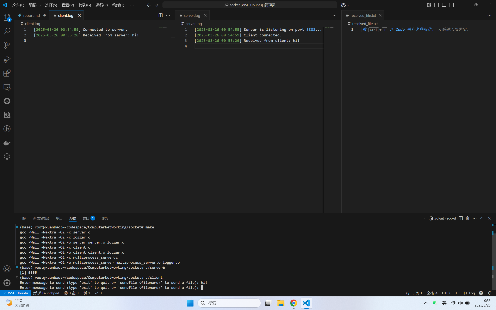

# Computer Networking
## Assignment 1
### Project Information
This project is in $\text{C}$ language.  
#### Compile
The `makefile` is ready in the zip folder. To compile the programs, just type in `make` in terminal to generate ELF `server`, `client` and `multiprocess_server`.  
#### Running
To run them, type in `./server&` at first, and then `./client`. For `./multiprocess_server`, you need to have some new terminals to `./client`. That's because the multi server needs `exit` typed in to close, and the input should never be mixed with client input.
#### Introduction
The program `client` can connect to both servers. `server` have no multiprocess function. 
#### Functions
- message sending  
  Type in any message but `exit` or `sendfile <filename>`, you'll find server return the same message.
- file sending  
  You can see `a.txt` of more than 1024 bytes. By typing in `sendfile a.txt`, you send the file to server who will save it in `received_file.txt`, which is hard-coded in program `server` and `multiprocess_server`. Related informations will be sent.  

**Important note: you cannot see the information in stdout. Instead, they will be recorded in auto-generated log `client.log` and so on.**
### Output
#### Task 1
**Beginning:** information about port and connection establishment, as well as hello word `hi`.

**Then:** `sendfile a.txt`, and the content come into `received_file.txt`. Related information such as "`File received successfully`" are logged.

**Analyze:**   
In `server.c`:  
It creates socket, allows reuse-address(then you can immediately `./` after `exit`), binds address, listens port, and accepts one client socket.  
During these time, it logs which port it is listening and whether the process is successful.  
Then, it calls `handle_client`. It opens a 1024 size buffer, and in a while loop, it always `recv` packet from socket, and compares the information with the following:
- Case 1: `exit`, it breaks out the loop and close.  
- Case 2: `sendfile <filename>`, it gets the `<filename>` and sends back `Ready to receive file: <filename>` and calls `write_file_from_client` It logs `prepare to receive file` and looply `recv` buffer, tests if the last 4 useful bytes are `\xFF\xFF\xFF\xFF`(EOF_MARKER), and flushs into the file, then logs `File receive successfully`.  
- Case 3: default, returns back the information to client.

In `client.c`:
It creates socket, connects to server, and in a while loop, it gets terminal input, compares input with the following:
- Case 1: `exit`, it set a flag to `1` and call the server `exit` at first. Client will exit later by the flag.
- Case 2: `sendfile <filename>`, it send buffer, wait for server reply `ready to receive`, and call `send_file` to send the file content and EOF_MARKER. It then wait server reply to finish.
- Case 3: default, send buffer and receive exactly what it sent.

**Flowchart**

#### Task 2
**Beginning:**  
For multiprocess(in fact, multi-thread) server, it has an array to maintain `client_socket` list. Thus, it can serve 5 clients at max(reject more), and in its log, client number is recorded the same time.

**Working:**  
The messages are noted with the client number they come from. The `sendfile <filename>` still work correctly. Even all clients shut down, the server will not shut down. 

If some of the clients shut down, other unconnect clients can connect to the server then.

If server shut down, all clients are unconnected and their sockets will be shut down as well.

**Analyze:**  
1. I added a `input_thread` which listen to server terminal input, as server cannot be closed by client this time. If input `exit`, it close all connected clients, who are in the maintain list, and change global int `running` to 0.
2. If running, see if there is client waiting, accept it. This is by `fcntl`, and accept does not block any more. Then add client socket to the maintain list if not exceed max limit. Then create new thread to handle the client.
3. `handle client` has minor difference: it has arg in void * and return void *, to meet the need of pthread_create.