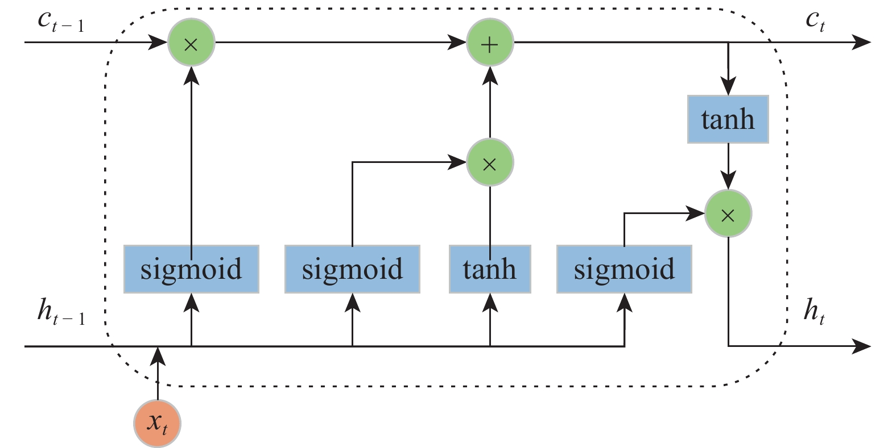

# 情感分类实验报告
### 仲嘉暄 计35 2023010812
Honor Code和项目介绍在最后。
## 结构和流程
### RNN-LSTM结构
- 首先通过和 `CNN` 一样的 `embedding` 层。
- 然后经过循环层 `lstm(x)`，输入大小为词向量长度，设置隐藏层的大小、层数、`dropout`，设置双向 `LSTM`。取本层输出的隐藏状态，取 `LSTM` 最后一层正反的输出，拼接起来。
- 然后是两层全连接，中间用 `relu` 函数和 `dropout` 两个操作。它们把 `2 * hidden_size` 也就是拼接起来之后的长度映射到某个 `internal`，再映射到 2 输出。
- 总结构：输入$\rightarrow$嵌入层$\rightarrow$循环层$\rightarrow$全连接层1$\rightarrow$全连接层2$\rightarrow$输出。

### RNN-GRU结构
- 和 `LSTM` 相比，`GRU` 仅在取循环层输出的隐藏状态有微小差别，不再赘述。下面两幅图前者是 `LSTM`，后者则是 `GRU`。

### CNN结构
- 首先通过 `embedding` 层，`embedding` 层将每个词索引（整数）翻译成一个词向量（数组）。
- 然后，经过适当变形，通过卷积层。卷积层包含 `len(filter_sizes)` 个 1 通道输入、`num_filters` 通道输出，每个滤波器 的大小为 `filter_height * embedding_dim`，也就是 `同时卷积词数 * 词向量长度`，即论文所说的 $w\in\mathbb{R}^{hk}$。每个 `filter_sizes` 对应数组里一个 `batch_size * num_filters * (aligned_length - filter_height + 1)` 的输出组，也就是每个句子、每个滤波器都输出一个 `aligned_length - filter_height + 1` 长度（即 $\mathbf{c}=[c_1,c_2,\ldots,c_{n−h+1}]$）的特征图，特征图是一维数组。
- 然后进行最大特征池化，在每个输出组的第三维，也就是取每个 $\mathbb{R}^{n-h+1}$的最大值。此时输出的是 `len(filter_sizes)` 个 `batch_size * num_filters` 的张量。
- 将它们拼接起来，每个句子长度变成 `num_filters * len(filter_sizes)`，经过 `dropout`， 和 `num_filters * len(filter_sizes)` 输入、2 输出的全连接层。
- 总结构：输入$\rightarrow$嵌入层$\rightarrow$卷积层$\rightarrow$池化层$\rightarrow$全连接层$\rightarrow$输出。

### MLP（baseline）结构
- 先通过 `embedding` 层。
- 全连接层先把 `embedding_dim` 长度的向量映射到 `hidden_size` 长度上，然后经过 `relu`，对每个句子的各个词做最大池化，`dropout`，最后全连接把 `hidden_size` 输入映射到 2 输出。
- 总结构：输入$\rightarrow$嵌入层$\rightarrow$全连接层1$\rightarrow$池化层$\rightarrow$全连接层2$\rightarrow$输出。

### 流程
- 先 `parser_data`，设置所有相关参数配置 `config`，并构建模型，将相关的参数和模型返回主文件。在生成配置的时候同时调取 `wiki_word2vec_50.bin` 的词向量存起来，这样直接通过配置传入嵌入层即可。
- 再 `getDataloader` 取得 `train`、`val`、`test` 的 `dataloader`，即先从语料取得一一对应的句子数组和标签数组，每个句子对应一个情感标签。然后将二者做成数据集，数据集打乱、多线程生成加载器。
- 设置交叉熵函数、优化器、学习率调度器，优化器权值衰减来对应论文中的 $l_2$ 范数约束。
- 在每个 `epoch`，先后进行 `train()` 训练、用验证集和测试集的加载器进行 `evaluate()` 测试。
- 训练时进入循环，对每批数据，调用优化器、损失函数进行梯度清零、反向传播和参数更新等。同时计算本批总数和正确数和本批损失，把实际标签和预测标签附加在某列表后面。最后跳出循环计算平均损失、总准确率、使用调度器、计算f1.
- 评估的 `evaluate()` 的区别是，在 `with torch.no_grad()` 条件下，不再进行梯度清零、反向传播和参数更新，跳出循环之后也不使用学习率调度器。
## 实验效果
已知最好的实验效果来源于 `os.system("python main.py -lr 2e-3 -e 1 -a 80 -b 20 -hs 64 -d 0.2 -f 128 -u")`，也就是学习率 $2\times10^3$，`epoch=1`，句子对齐到 80 长度，一批训练 20 个，使用卷积神经网络，丢弃率 0.2，滤波器 120 个，允许更新词向量。其结果为
~~~log
Train Loss: 0.2046, Train Acc: 0.9190, Train F1: 0.9189
Val Loss: 0.3877, Val Acc: 0.8449, Val F1: 0.8534
Test Loss: 0.3307, Test Acc: 0.8726, Test F1: 0.8798
~~~
这里的损失较低，准确率很高，达到近似 $\text{Acc}\geqslant85$。`F1` 很高，说明没有盲猜的情况。  
如果增加 `epoch`，可以发现验证集和测试集的 `loss` 急剧上升到接近甚至超过 1，这是因为允许根据训练集修改词向量，导致参数极其接近训练集情况（训练集准确率在第 8 个 `epoch` 甚至能达到 1，即全对），但验证和测试集准确率却会下降，造成了过拟合。
## 调参（主要是CNN模型）
### 句子对齐长度：
| align | Train Acc | Train F1 | Val Acc | Val F1 | Test Acc | Test F1 |
|-------|-----------|----------|---------|--------|----------|---------|
| 20 | 0.8856 | 0.8850 | 0.7563 | 0.7600 | 0.7534 | 0.7507 |
| 50 | 0.9169 | 0.9169 | 0.8112 | 0.8168 | 0.8130 | 0.8150 |
| 80 | 0.9155 | 0.9153 | 0.8218 | 0.8228 | 0.8266 | 0.8202 |
| 120 | 0.9176 | 0.9175 | 0.8158 | 0.8146 | 0.8347 | 0.8291 |
| 150 | 0.9176 | 0.9176 | 0.8207 | 0.8201 | 0.8266 | 0.8222 |

可见截取 $50-80$ 就已经足够表达句意了，过长反而会引入噪声。
### 批大小
| batch | Train Acc | Train F1 | Val Acc | Val F1 | Test Acc | Test F1 |
|-------|-----------|----------|---------|--------|----------|---------|
| 20 | 0.9406 | 0.9406 | 0.8192 | 0.8175 | 0.8293 | 0.8264 |
| 35 | 0.9293 | 0.9292 | 0.8223 | 0.8197 | 0.8211 | 0.8146 |
| 50 | 0.9158 | 0.9157 | 0.8172 | 0.8174 | 0.8293 | 0.8255 |
| 65 | 0.9078 | 0.9076 | 0.8188 | 0.8135 | 0.8211 | 0.8081 |
| 80 | 0.8969 | 0.8969 | 0.8190 | 0.8211 | 0.8374 | 0.8324 |

可见批大小还是小一点好。过大可能影响参数更新，参考[本文](https://juejin.cn/post/7085492398142259236)。
### 丢弃率
| dropout | Train Acc | Train F1 | Val Acc | Val F1 | Test Acc | Test F1 |
|-------|-----------|----------|---------|--------|----------|---------|
| 0.1 | 0.9508 | 0.9508 | 0.8186 | 0.8186 | 0.8157 | 0.8152 |
| 0.2 | 0.9313 | 0.9313 | 0.8161 | 0.8194 | 0.8428 | 0.8415 |
| 0.3 | 0.9148 | 0.9146 | 0.8160 | 0.8105 | 0.8266 | 0.8161 |
| 0.4 | 0.9026 | 0.9025 | 0.8138 | 0.8110 | 0.8157 | 0.8090 |
| 0.5 | 0.8797 | 0.8796 | 0.8140 | 0.8156 | 0.8266 | 0.8242 |

丢弃率过小则测试集表现不佳，出现过拟合或过参数化，丢弃率过大则整体表现不佳。`0.2` 的时候比较合适。
### epoch
| epoch | Train Acc | Train F1 | Val Acc | Val F1 | Test Acc | Test F1 |
|-------|-----------|----------|---------|--------|----------|---------|
| 3 | 0.8222 | 0.8224 | 0.8010 | 0.7863 | 0.7886 | 0.7636 |
| 5 | 0.8666 | 0.8665 | 0.8135 | 0.8036 | 0.8022 | 0.7834 |
| 10 | 0.9117 | 0.9114 | 0.8193 | 0.8167 | 0.8211 | 0.8125 |
| 15 | 0.9194 | 0.9192 | 0.8186 | 0.8176 | 0.8266 | 0.8192 |
| 20 | 0.9256 | 0.9256 | 0.8160 | 0.8162 | 0.8455 | 0.8403 |

随着训练量增大，训练集准确率上升，但验证集准确率反而下降，出现过拟合。
### 卷积核个数
| filter | Train Acc | Train F1 | Val Acc | Val F1 | Test Acc | Test F1 |
|-------|-----------|----------|---------|--------|----------|---------|
| 16 | 0.8490 | 0.8485 | 0.8026 | 0.8072 | 0.8022 | 0.8032 |
| 32 | 0.8814 | 0.8813 | 0.8092 | 0.8085 | 0.8103 | 0.8034 |
| 64 | 0.9127 | 0.9127 | 0.8181 | 0.8184 | 0.8320 | 0.8278 |
| 96 | 0.9379 | 0.9378 | 0.8167 | 0.8082 | 0.8266 | 0.8150 |
| 128 | 0.9521 | 0.9521 | 0.8202 | 0.8219 | 0.8428 | 0.8415 |

很明显，卷积核多多益善。
### 隐藏层大小（仅限RNN）
| hidden | Train Acc | Train F1 | Val Acc | Val F1 | Test Acc | Test F1 |
|-------|-----------|----------|---------|--------|----------|---------|
| 32 | 0.8144 | 0.8161 | 0.8028 | 0.8021 | 0.8103 | 0.8011 |
| 64 | 0.8318 | 0.8331 | 0.8119 | 0.8173 | 0.8293 | 0.8293 |
| 96 | 0.8241 | 0.8265 | 0.8046 | 0.8146 | 0.8266 | 0.8298 |
| 128 | 0.8120 | 0.8131 | 0.7991 | 0.8069 | 0.8211 | 0.8263 |
| 160 | 0.8300 | 0.8320 | 0.8072 | 0.8027 | 0.8211 | 0.8125 |

这个大小在 `64` 时比较好，并不是越复杂就越好的。
### 隐藏层数（仅限RNN）
| layer | Train Acc | Train F1 | Val Acc | Val F1 | Test Acc | Test F1 |
|-------|-----------|----------|---------|--------|----------|---------|
| 1 | 0.8204 | 0.8224 | 0.8069 | 0.8095 | 0.8266 | 0.8202 |
| 2 | 0.8270 | 0.8283 | 0.8042 | 0.8045 | 0.8320 | 0.8268 |
| 3 | 0.5000 | 0.6667 | 0.4996 | 0.6663 | 0.5068 | 0.6727 |

隐藏层数的复杂化没什么用，只会大大拖慢训练时间，设置成 `2` 即可。
### 学习率
| rate | Train Acc | Train F1 | Val Acc | Val F1 | Test Acc | Test F1 |
|-------|-----------|----------|---------|--------|----------|---------|
| 0.0001 | 0.7846 | 0.7863 | 0.7731 | 0.7739 | 0.7778 | 0.7670 |
| 0.0005 | 0.8721 | 0.8722 | 0.8099 | 0.8083 | 0.8184 | 0.8102 |
| 0.001 | 0.9208 | 0.9206 | 0.8184 | 0.8206 | 0.8293 | 0.8274 |
| 0.002 | 0.9391 | 0.9393 | 0.8238 | 0.8224 | 0.8238 | 0.8189 |
| 0.005 | 0.9043 | 0.9041 | 0.8128 | 0.8069 | 0.8211 | 0.8125 |
| 0.01 | 0.8778 | 0.8778 | 0.8030 | 0.8017 | 0.8157 | 0.8090 |
| 0.1 | 0.6619 | 0.6332 | 0.7280 | 0.7119 | 0.7507 | 0.7294 |

经过多次尝试，选择学习率为 $0.002$。其表现明显优于其他学习率。
### 是否更新词向量
| update | Train Acc | Train F1 | Val Acc | Val F1 | Test Acc | Test F1 |
|-------|-----------|----------|---------|--------|----------|---------|
| False | 0.9206 | 0.9206 | 0.8140 | 0.8167 | 0.8103 | 0.8098 |
| True | 0.9991 | 0.9991 | 0.8506 | 0.8519 | 0.8347 | 0.8365 |

看起来更新词向量后，在验证和测试集也有一定优势，可能由于语料库里影评、商品评价之类内容之间有共性，和wiki的有一点微小的区别。
### internal（仅限RNN）
修改中间层维度为 64，迅速过拟合，无实际应用价值。
## 模型
| model | Train Acc | Train F1 | Val Acc | Val F1 | Test Acc | Test F1 |
|-------|-----------|----------|---------|--------|----------|---------|
| CNN | 0.9158 | 0.9155 | 0.8192 | 0.8189 | 0.8211 | 0.8167 |
| RNN_LSTM | 0.8267 | 0.8290 | 0.8108 | 0.8156 | 0.8320 | 0.8297 |
| RNN_GRU | 0.8512 | 0.8522 | 0.8215 | 0.8252 | 0.8482 | 0.8495 |
| MLP | 0.8296 | 0.8288 | 0.8193 | 0.8182 | 0.8103 | 0.8066 |

`CNN` 的训练准确率显著高于其他，但在验证、测试集上却没有什么特殊优势，过于“柔软”，影响了其泛化能力。  
循环神经网络在验证和测试集上普遍表现更好，尤其是 `RNN_GRU` 双料第一，说明 `RNN` 在实际应用中更能够学到句子的情感特征。  
`baseline` 模型 `MLP` 结构简单，就是单纯的全连接+`relu`+`dropout`，效果虽然不如 `CNN` 和 `RNN`，但相差不多。后续实验表明，如果不用 `dropout`，`MLP` 会在第 2 个 `epoch` 之后迅速进入过拟合状态，说明这些优化对 `MLP` 也很重要。  
可以看到，`F1` 分数和准确率相差不大，表明这几个模型类别均衡做的不错，不存在由于类别不均导致的盲猜现象。  
综上所述，`CNN`、`RNN` 与 `baseline` 相比都有优化，`CNN` 在准确率提高之外，训练速度也大大提升了（大约 `CNN 4s/epoch，RNN 20s/epoch，MLP 10s/epoch`）。但是，`baseline` 仍有一个较高的正确率，这是两层全连接带来的足够复杂性导致的。综合考虑准确率和训练速度，`CNN`的优势比较大。但如果对正确率非常敏感，建议采用 `RNN`，尤其是 `GRU`。
## 问题思考
### 停止训练问题
我认为，等到在验证集、测试集上的准确率不再上升就可以停止了，而在我代码中实现的是为了方便起见的固定长度 `epoch=10`。固定长度的好处是，简单易实现，可以根据 `epoch` 推进输出的准确率和损失来人工决定最佳epoch；缺点则是可能导致训练不足，重新训练就要白费功夫，而如果训练过多的话，既导致过拟合，也浪费时间，尤其对于一个 `epoch` 比本实验久的多的超大规模参数模型，`epoch` 过多的影响会更加巨大。通过验证集调整，也就是若干轮损失不减少、验证集准确率不增加就停止的好处是，这种方法是结果导向的停止方法，所以很可能会达到一个最优、至少局部最优的结果然后自适应地停止，保证充足而不过多的训练。但其缺点是，需要验证集大小够大以减小随机性，并且需要额外的代码实现。最重要的问题就是怎么设定一个停止条件，是简单的连续固定长度 `epoch` 损失不下降就停止，还是用一个复杂函数处理损失、准确率乃至 `F1 score`？我认为早停法已经足够了。当然，应该对波动有一定认识，也就是如果连续几个 `epoch` 的损失下降在某个很小的数以内就停止。如果这么实现，我认为，在工程实践上，根据验证集停止训练是更好的。
### 参数初始化
查询原码发现，`Conv2d` 和 `Linear` 使用的是 `kaiming` 初始化，`LSTM` 和 `GRU` 使用的是 `pytorch` 自己对 `RNN` 进行的 $U(-\dfrac{1}{\sqrt{hiddensize}},\dfrac{1}{\sqrt{hiddensize}})$ 初始化。
- 零均值初始化是将参数初始化为均值为 0 的随机分布（如均匀分布或高斯分布）。但如果所有参数初始化为完全相同的值（如全零），会导致梯度消失。通常用于简单的模型或作为其他初始化方法的基础。
- 高斯分布初始化是从 $N(\mu,\sigma^2)$ 随机采样作为参数，相对于全零初始化，参数的随机性有助于打破对称性，避免神经元的输出完全相同。但是，方差过大或过小都可能导致梯度消失。方差过大，很大的输入使函数值接近 0 和 1 而梯度消失；方差过小，深层网络可能因权重值过越来越小导致梯度消失。适合深度较浅的网络或小型模型。
- 正交初始化是将权重初始化为正交矩阵。通过对某个高斯随机矩阵进行 QR 分解后，得到 Q 矩阵实现。通过保输入向量和梯度向量的范数，避免了梯度消失或梯度爆炸的问题。因此，适合深度很深的网络和循环神经网络。
- `Xavier` 初始化：由于神经网络的输入输出 $y = f(w_1x_1 + w_2x_2 + ... + w_ix_i + b)$，考虑激活函数 $f$ 线性或近似线性、偏置 $b=0$，由权值、输入的独立性，$\text{Var}(y)=n\text{Var}(w_1)\text{Var}(x_1)$。为了保 $y$ 和 $x$ 的方差不变，需要 $\text{Var}(w_1)=\dfrac{1}{n}$。考虑前向和反向，$\text{Var}(w_1)=\dfrac{2}{n_{in}+n_{out}}$。那么，$W \sim U\left( -\sqrt{\dfrac{6}{n_{\text{in}} + n_{\text{out}}}}, \sqrt{\dfrac{6}{n_{\text{in}} + n_{\text{out}}}} \right)$ 或 $W \sim N\left( 0, \dfrac{2}{n_{\text{in}} + n_{\text{out}}} \right)$。适用于近似线性的激活函数，浅层网络或激活函数非线性较弱的深层网络。
- `Kaiming` 初始化专门针对 `ReLU` 做了改进。由于 `ReLU`，上一层的输入有一半都是 $0$，$\text{Var}(y)=\dfrac{1}{2}n\text{Var}(w_i)\text{Var}(x_i)$ 所以 $\text{Var}(w_i)=\dfrac{2}{n}$，将上面的改成$W \sim U\left( -\sqrt{\dfrac{6}{n}}, \sqrt{\dfrac{6}{n}} \right)$ 或 $W \sim N\left( 0, \dfrac{2}{n} \right)$。适用于含有 `ReLU` 的深层神经网络。
### 防止过拟合
- 数据层面-数据增强：打乱数据，增加数据量，训练的模型会更接近实际情况。
- 权重层面-正则化：进行 $l_2$ 正则化权重衰减，避免模型参数过大，学到噪声。
- 模型层面-`dropout`：丢弃一部分神经元，防止神经元过度协同。
- 训练层面-早停：验证集的性能不再提升时停止训练。
### 模型优缺点
1. `CNN`
- 优点：
  - `CNN` 通过卷积操作提取局部特征，发现局部相关性。
  - 卷积核共享参数，显著减少了模型的参数数量。
  - 由于参数较少，以及可以并行计算，训练速度快于 `RNN` 和 `MLP`。
- 缺点：
  - 无法捕捉长距离依赖。
  - 卷积核大小限制，可能丢失语义信息。
2. `RNN`
- 优点：
  - `RNN` 通过循环结构能够记忆上下文。
  - `RNN` 输入可变长度。
  - `RNN` 可以保留一定顺序信息。
- 缺点：
  - 循环结构导致训练时间较长，难以并行化。
  - 相当于很深很深的网络，容易发生梯度消失或梯度爆炸。
3. `MLP`
- 优点：
  - 结构简单，易于实现和理解。
  - 可并行计算或者利用矩阵计算提高效率。
- 缺点：
  - 每一层的神经元与上一层的所有神经元相连，参数量大，易过拟合。
  - 无法捕捉局部特征和序列信息，表达能力差。
## 心得体会
在这次实验中，我通过AI学习法，并结合学长代码仓库，从头开始、动手实践，了解了如何调库搭建起一个自己的模型，以及模型训练与评价所需的标准、调度器、优化器及其操作，了解了大量有关神经网络的知识，比如如何规避过拟合、如何进行初始化等等。但最重要的还是自己学习的能力，在拿到代码仓库之后，如何利用互联网资源和AI把前人代码吃透，如何从论文中获得必要信息并检查是否实现一致（比如，前人的CNN代码似乎没有像论文要求的那样进行$l_2$正则化？），等一系列科研、工作中都需要的能力。同时，要感谢前人代码，让我少走了无数弯路，比如把参数全都初始化为0而造成梯度消失等等。总之，在自己动手操作下，课上据说很厉害的那些神经网络也就发挥了实力，才真正落到实处，有了真实感。在实际过程中，有和理论很一致的，比如RNN对序列信息的处理、CNN并行计算带来的高效，也有和我上完课之后想象不一样的，比如不同的模型之间的差别也就两三个点，并没有每种模型对任务远超其他模型的感觉（当然，有可能是因为优化过了）。我还认识到了参数的重要性，参数带来的影响比模型不同的影响大多了。虽说调参如炼丹，但还是应该用理智和科学先算一遍，因为测试不同参数的模型真的太耗时耗电了。还有，我的工程能力也提高了，主要是通过把学长代码拆的更加细碎，捋清了项目脉络，有的一个文件就一个函数，非常专用。这样，耦合度就大大降低了，爽！
## 其他
### Honor Code
我参阅了[赵晨阳学长的代码](https://github.com/zhaochenyang20/IAI_2022/tree/main/homework/segmentation)和[熊泽恩学长的代码](https://github.com/leverimmy/Introduction-to-Artificial-Intelligence-Homework/tree/main/Classification)，还使用了copilot、deepseek、豆包、元宝deepseek等多种大模型，Xavier和Kaiming初始化相关信息看了[csdn-Xavier参数初始化方法和Kaiming参数初始化方法详细介绍及其原理详解](https://blog.csdn.net/IronmanJay/article/details/128888954)。
### 项目介绍
log：调参过程的日志文件。  
config.py：输入参数，初始化配置。  
dataloader.py：创建数据装载器。  
load.py：从语料库里获得一切词语，安排索引，把索引、词语、词向量联系起来。  
log2md.py：通过正则表达式把log文件转换成markdown表格的脚本，与项目无关，只用来写报告。  
main.py：主逻辑，进行训练和测试。  
models.py：实现四种神经网络，继承nn.Module。  
pipeline.py：训练的时候一键运行批量训练测试不同参数的模型。
