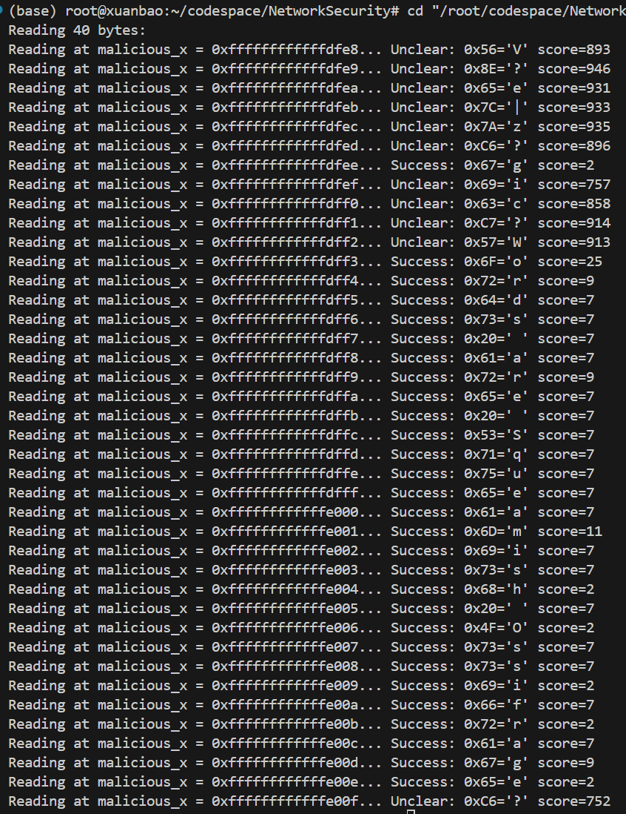
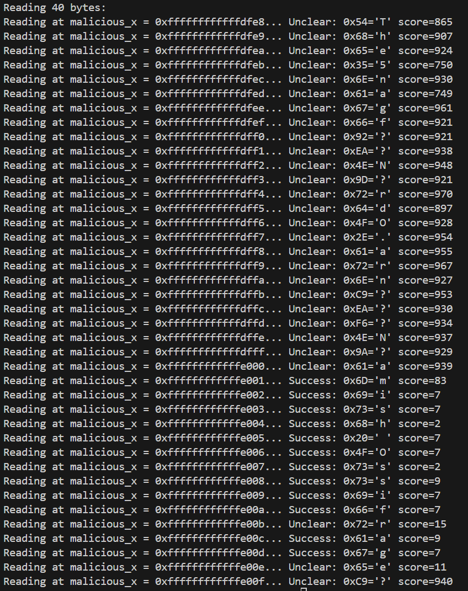
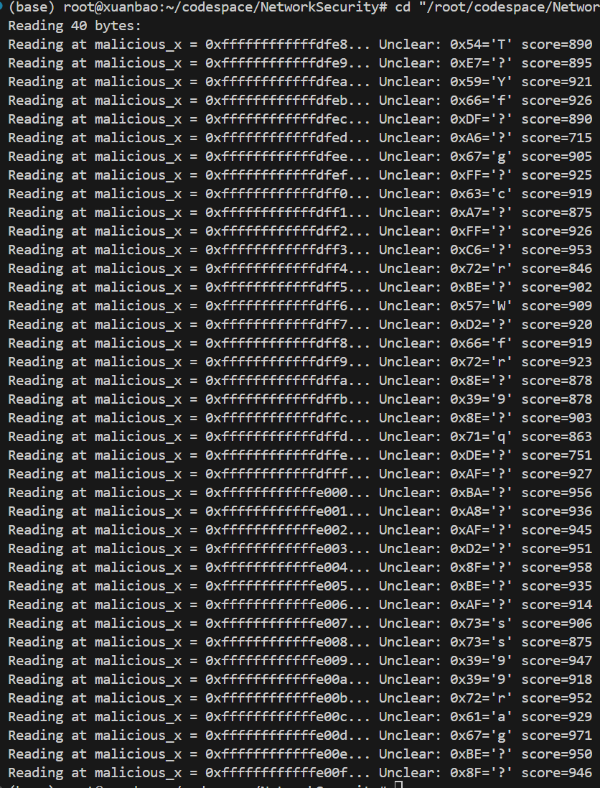

# Spectre 攻击验证
## 实验步骤
### 实验变量：
- 全局变量：
  - 字符数组 `const char *secret` 用于存放敏感数据；
  - 数组 `uint8_t spy [16] = {1,・・・,16}` 用于越界读取 `secret` 数据；
  - `spy_size` 上面数组的大小；
  - 数组 `uint8_t cache_set [256*512]` 用于构建缓存驱逐集，256的原因是ASCII码；
  - 受害函数`victim_function`：
    ~~~c
    void victim_function(size_t x)
    {
        if (x < spy_size)
        {
            temp &= cache_set[spy[x] * 512];
        }
    }
    ~~~
  - `uint8_t temp = 0` 避免受害函数被优化；
  - `#define CACHE_HIT_THRESHOLD 80` 设置缓存命中与否的时间差。
- 主函数变量：
  - `size_t malicious_x = (size_t)(secret - (char *)spy)` 秘密字符串和越界读取器的偏移量；
  - `int len = 40` 秘密字符串长度；
  - `uint8_t value[2]` 缓存命中次数前两名的字符；
  - `int score[2]` 缓存命中次数前两名的次数。
- 操作函数变量：
  - `result [256]` 用于统计缓存命中次数，泄露敏感数据；
  - `tries` 循环轮数，每个字母要循环1000次；
  - `training_x = tries % spy_size` 是从0到15周期性变化的正确索引；
  - `mix_i = ((i * 167) + 13) & 255` 是读取 `cache_set` 用的索引，在 `i` 从0到255变化时 `mix_i` 覆盖了0到255的全部数字，且无规律，规避了步长预测（处理器可能会提前按顺序以我们取cache_set的步长预取cache_set到缓存中）。
### 实验过程及步骤：
1. 将 `secret` 地址减去 `spy` 地址得到 `malicious_x`，为使用 `spy` 越界读取敏感信息做准备；
2. 写入 `cache_set`，以确保它在内存中；
3. 对于每一个字符（`malicious_x++` 即可移动到下一个字符），重复以下步骤1000次：
   1. `result`数组全部置零；
   2. 使用 `_mm_clflush` 指令清空 `cache_set` 数组的缓存状态；
   3. `training_x = tries % spy_size`（在这 $1000$ 轮从 $0$ 到 $15$ 循环）；
   4. 为保证成功读取敏感数据，以下步骤循环 $5$ 到 $10$ 次：
      1. 使用 `_mm_clflush` 指令清除在缓存中的 `spy_size`；
      2. 延迟一段时间，确保上面指令执行完毕；
      3. 根据轮数对 $6$ 取余，确保每五次使用正确的索引 `training_x < 16`（`training_x` 取 $0$ 到 $15$ 的固定值）调用 `victim_function` 后，用 `malicious_x` 调用 `victim_function` 一次。这里为了迅速且不影响分支预测，使用数学运算替代 `if-else`。
   5. 读取变量 `junk`（在缓存中）内容并计算读取时间 `time1`，再读取 `cache_set`（极少数在缓存中，其要读取的位置已算好，存在 `addr` 中）内容并计算读取时间 `time2`。如果对于 `cache_set` 的某个索引 `i`， `time1 - time2 < Threshold`，而且 `i` 和 `training_x` 不同，即说明 `i` 在缓存中，且较有可能是 `malicious_x` 时存入缓存的。可以证明，这种情况下 `i` 是 我们这一轮所寻找的字符。则 `result[i]++`，取重复多次之后 `result[i]` 最大的一个 `i`。此处读取 `cache_set` 内容时用 `mix_i` 索引，规避了步长预测。还可以特判一些成功的 `result[]` 情况。找到了字符，可以直接退出，移动到下一个字符。
### 实验结果
实验结果受到许多因素的影响。  
好情况如图所示：

但随着多次实验，缓存、分支预测器、系统负载可能受到了影响，也有可能激活了处理器的一些优化（步长预取之类），实验效果会变差。
有一部分是对的：

基本上看不出来敏感信息：

### 参考资料
[IEEE S&P上的Spectre原始文章](https://ieeexplore.ieee.org/abstract/document/8835233)
其后附有代码。