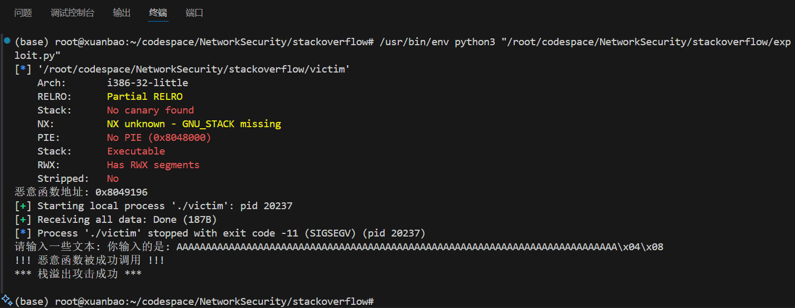

# 简单栈溢出攻击
## 实验步骤
首先，我先实现了受害函数的 `c` 语言代码：
~~~c
#include <stdio.h>
#include <string.h>

// 攻击者希望调用的恶意函数
void malicious_function()
{
    printf("!!! 恶意函数被成功调用 !!!\n");
    printf("*** 栈溢出攻击成功 ***\n");
}

// 存在漏洞的受害函数
void vulnerable_function()
{
    char buffer[64]; // 小缓冲区容易溢出

    printf("请输入一些文本: ");
    gets(buffer); // 不安全的函数，不检查输入长度

    printf("你输入的是: %s\n", buffer);
}

int main()
{
    vulnerable_function();
    printf("程序正常退出\n");
    return 0;
}
~~~
我的意图是让 `buffer` 溢出本级栈而覆盖程序计数器返回地址到恶意函数。
我使用 `echo 0 | sudo tee /proc/sys/kernel/randomize_va_space` 关闭系统环境下的地址空间分布随机化机制，`gcc -m32 -fno-stack-protector -z execstack -no-pie victim.c -o victim` 将编译目标指定为32位，关闭Stack Canary保护和PIE，设置栈为可执行的。用 `objdump -d victim > victim.s` 反汇编：
~~~x86asm
080491d2 <vulnerable_function>:
 80491d2:	55                   	push   %ebp
 80491d3:	89 e5                	mov    %esp,%ebp
 80491d5:	53                   	push   %ebx
 80491d6:	83 ec 44             	sub    $0x44,%esp
 80491d9:	e8 f2 fe ff ff       	call   80490d0 <__x86.get_pc_thunk.bx>
 80491de:	81 c3 22 2e 00 00    	add    $0x2e22,%ebx
 80491e4:	83 ec 0c             	sub    $0xc,%esp
 80491e7:	8d 83 4a e0 ff ff    	lea    -0x1fb6(%ebx),%eax
 80491ed:	50                   	push   %eax
 80491ee:	e8 5d fe ff ff       	call   8049050 <printf@plt>
 80491f3:	83 c4 10             	add    $0x10,%esp
 80491f6:	83 ec 0c             	sub    $0xc,%esp
 80491f9:	8d 45 b8             	lea    -0x48(%ebp),%eax
 80491fc:	50                   	push   %eax
 80491fd:	e8 5e fe ff ff       	call   8049060 <gets@plt>
 8049202:	83 c4 10             	add    $0x10,%esp
 8049205:	83 ec 08             	sub    $0x8,%esp
 8049208:	8d 45 b8             	lea    -0x48(%ebp),%eax
 804920b:	50                   	push   %eax
 804920c:	8d 83 62 e0 ff ff    	lea    -0x1f9e(%ebx),%eax
 8049212:	50                   	push   %eax
 8049213:	e8 38 fe ff ff       	call   8049050 <printf@plt>
 8049218:	83 c4 10             	add    $0x10,%esp
 804921b:	90                   	nop
 804921c:	8b 5d fc             	mov    -0x4(%ebp),%ebx
 804921f:	c9                   	leave  
 8049220:	c3                   	ret    
~~~
研究汇编代码，我们将 `buffer` 作为参数传给了 `get` 函数，而 `80491f9` 这行的代码把 `-0x48(%ebp)` 这个地址放进了参数寄存器 `eax`，可知 `buffer` 的地址是 `%ebp-0x48`。从 `80491d3` 处代码可知，最新的 `%ebp` 是 `%esp` 寄存器 `mov` 过来的，当时的 `%esp` 刚刚经历了 `push   %ebp` 而指向 `caller` 的栈基址原值，所以返回地址的位置应该在 `%ebp+0x4`（32位）。那么，我们的填充长度就是 `0x48+0x4`，然后再填上小端序的恶意函数地址即可。我们用 `pwn` 获取恶意函数地址：
~~~python
# 获取恶意函数地址
def get_malicious_addr():
    # 使用ELF加载二进制文件
    elf = ELF(binary_path)
    return elf.symbols["malicious_function"]
~~~
## 实验结果
攻击成功！

## 参考
Github Copilot 和 deepseek。